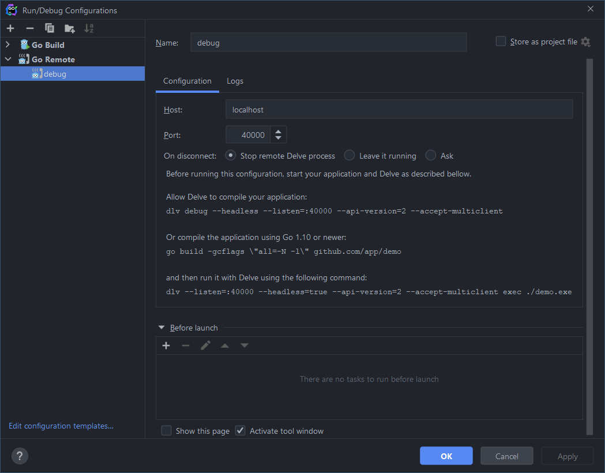

### For debugging you need to have [delve](https://github.com/go-delve/delve/blob/master/Documentation/installation/README.md) installed.
#### If you want to work on Windows, I suggest you to use WSL2. For that, you need GoLand 2021.3, as earlier versions _**do not**_ support WSL.

## Configuring GoLand to use remote debugging
All debugging is made on remote server. That gives us possibility to run it via makefile
and to use it in WSL or a Docker container. In GoLand, you need to add a _**Run/Debug configuration**_ like that:

## Running a service in debug mode
Every service has equivalent suitable for debugging in the Makefile.
To start debugging, you just use make as always but add _-debug_ at the end of the name.

    make web-api-debug

## After making the service, you just run the _**Debug configuration**_ in GoLand to attach to debugger.